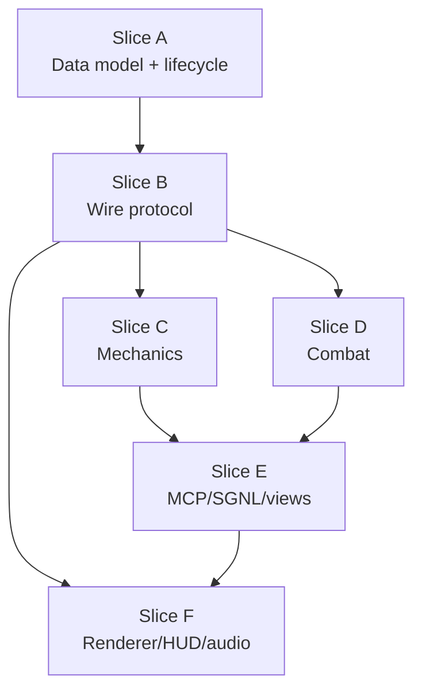

# Unify marine and monsters as peer actors — audit-first

## Landscape (problem statement — updated against repo)

1. **Historical pain (what we were escaping):** the marine used to be a pre-seeded `state.actors[0]` singleton with a parallel `player` snapshot column and a forest of `getMarine()` / `player` reads. That made possession, multiplayer, and “actor-shaped” features fight the data model.

2. **What still creates “singleton smell” today:** even with `getMarineActor()` scanning by `MARINE_ACTOR_TYPE` and control maps returning `null` when unbound, **some session-facing helpers still fall back to the marine** (see Slice **A** / **F** gaps in the Progress log table: possession camera/geometry `|| getMarineActor()`, HUD weapon rows still driven off `getMarineActor()` while possessing). Legacy string ids (`'player'`, `'actor:0'`) remain as *input* aliases in places.

**Consequence:** “peer actors” is not only spawn shape + wire format; it is also **eliminating silent marine fallbacks** in session-scoped reads and finishing renderer/HUD work so “what you see” tracks `getPlayerActor`, not the marine in the world.

The audit sections below keep the original proposals and risks as the engineering checklist; treat the **Progress log** table + YAML `todos` as the live completion signal, not the prose in older slice bullets (some still describe pre-refactor file lines).

## Slice A — Data model & lifecycle (foundation)

Prerequisite for every later slice. Touching data shape without this → breaks snapshot replication.

- **`state.actors[0]` is special.** [src/game/state.js](src/game/state.js) exports `getMarine()`, `MARINE_SLOT`, `MARINE_THING_TYPE`, and pre-seeds `state.actors` with a fully-built marine object. [src/game/lifecycle.js#clearSceneState](src/game/lifecycle.js) pops `actors.length > 1` to preserve it. [src/game/things/registry.js](src/game/things/registry.js) comments "slot 0 is the marine".
  - **Proposal:** delete the pre-seeded marine from module init. Move `mapData.playerStart` into `mapData.things` as a regular entry (type 1) so the normal spawner pipeline handles it. `applyPlayerStart` is **deleted entirely** — no special-case lifecycle hook; marine spawns via `spawnThings()` → `registerActorEntry` like any other actor. No pinned slot, no `MARINE_SLOT`, no `MARINE_THING_TYPE` constants.
  - **Risk: L.** Touches initialization, snapshot hydration, state reset, assignment policy, map loader, tests.

- **Session ↔ actor wiring.** [src/game/possession.js](src/game/possession.js) `controllers: Map<sessionId, entity>` already exists. `getControlled()` defaults to `marine()`; `isControllingPlayer()` is true when unbound or controlling marine. `onPossessedDeath` forces `deathMode: 'gameover'` on `marine()` even when the dead body was a monster.
  - **Proposal:** (1) `getControlled(sessionId)` returns `null` when unbound (no fallback). Callers must handle the spectator case instead of silently acting on the marine. (2) Introduce `getPlayerActor(sessionId)` = the one actor whose controller is this session, or null. HUD/camera/audio/MCP listener consumes *this*, not `getMarine()`. (3) Game-over state lives on the *actor's controller slot*, not on the marine object; when the controlled body dies and no replacement is available, the session enters spectator/game-over, marine object (if any) is unaffected.
  - **Risk: L.** Every consumer of `getControlled() || marine()` needs review; "spectator with no body" becomes a legal state everywhere.

- **Initial entity schema.** Today the marine has `ammo/maxAmmo/ownedWeapons/collectedKeys/powerups/currentWeapon/isFiring/deathMode/armor/armorType`; monsters have `ai/target/state/painChance`. A possessed demon still inherits marine-shaped collisions/height via [src/game/possession.js#getControlledHeight](src/game/possession.js) overrides.
  - **Proposal:** hoist these into explicit sub-structs on every actor, present or absent as attributes drive behavior. Draft shape in "Capability schema" below.
  - **Risk: M.** Mostly mechanical; compiler won't catch omissions, so hand-audit every consumer.

- **Lifecycle reset.** [src/game/state-reset.js](src/game/state-reset.js) trims `actors.length > 1`; [src/game/lifecycle.js#transitionToLevel](src/game/lifecycle.js) / `applyPlayerStart` is marine-only; [src/app/level-loader.js#scheduleIntroCameraDrop](src/app/level-loader.js) tweaks marine z.
  - **Proposal:** reset drops all actors; map spawn creates every actor (including the marine-type one) from `mapData.things`; intro drop targets the session's controlled actor (`getPlayerActor(sessionId)`) rather than a global marine.
  - **Risk: M.**

- **Game-over on zero marines.** With the singleton gone, a map with no live marine-type actor must trigger game-over + restart (decision #4). Today `deathMode = 'gameover'` on the singleton marine serves this — without the singleton we need an explicit check.
  - **Proposal:** after each tick, if no actor with `type === 1` (marine) is alive anywhere, trigger game-over/restart on every session whose controlled actor is missing. Stretch (only if it falls out cheap): when the marine dies, demote its controlling session to spectator and, if the killer was a controlled actor, promote that session into the marine on restart.
  - **Risk: M.** Needs a clean signal path from damage → lifecycle → all sessions.

## Slice B — Wire protocol

After A lands (so both sides agree on shape). Before A, serialization breaks because client and server have different actor layouts.

- **Dual-shape `actors` block.** [server/world/snapshots.js](server/world/snapshots.js) `fillPlayerRecord` (id === 0: health, armor, ammo, ownedWeapons, isDead/isAiDead/isFiring, no `type`) vs `fillThingRecord` (id > 0: type, hp, aiState, collected, viewAngle…).
  - **Proposal:** single `fillActorRecord` that emits `loadout` / `ai` / `flags` as nested optional blocks. Slot id is just an id; no reserved 0.
  - **Risk: L.**

- **Legacy `player` top-level in `SnapshotMessageSchema`.** [src/net/protocol.js](src/net/protocol.js) optionally carries `player` alongside `actors`; [src/net/snapshot-apply.js#applyPlayer](src/net/snapshot-apply.js) mutates `getMarine()` and despawn explicitly skips id 0.
  - **Proposal:** delete the `player` key from the schema and `applyPlayer`. Everything goes through `applyActors` with the uniform record; id 0 is not special.
  - **Risk: M.**

- **Renderer / billboard interpolation.** [src/net/interpolation.js](src/net/interpolation.js) has `playerInterp`/`playerRender`/`updatePlayerRenderFromSnapshot` separate from `thingInterp`.
  - **Proposal:** one interp table keyed by `actor:<id>`; the "avatar shown as first person + billboard to peers" is just an actor with a DOM sprite.
  - **Risk: M.**

- **Server input: weapon-switch gate.** [server/world.js#processConnectionInputs](server/world.js) L144–146 gates `switchWeapon` on `getControlledFor(sid) === getMarine()`.
  - **Proposal:** gate on `canSwitchWeapons(controlled)` — true iff the actor has a `loadout.ownedWeapons` field. Monsters with intrinsic-only weapon don't qualify; a possessed marine-shaped actor would.
  - **Risk: S.**

## Slice C — Mechanics (movement, physics, doors, lifts, sound, hazards)

Can land in parallel with Slice D; they mostly touch different files. Prereq: A + B so `getControlled(sessionId)` returns the right thing for world-hazard sampling.

- **`asMovementActor` naturally disappears.** [src/game/entity/interop.js](src/game/entity/interop.js) L9–31 exists only because marine vs enemy carry different movement fields in different places. Once actors carry normalized `movement: { radius, height, eyeHeight, maxStepUp, maxDropHeight, baseSpeed, chaseSpeed, excludeSelfFromBlocking, attachToLifts, hazardSusceptible }` directly (from Slice A), the wrapper collapses — callers pass the actor itself.
  - **Proposal:** delete [src/game/entity/interop.js](src/game/entity/interop.js) `asMovementActor` / `actorTagForEntity`. Collision and chase read `actor.movement.*` directly.
  - **Risk: M.**

- **Collision uses marine singleton for geometry.** [src/game/physics/collision.js](src/game/physics/collision.js) `crossesLinedef` uses `marine().x/y` for "old side" regardless of mover; `canMoveToRaw` computes `playerTop = currentFloor + marine().height`; `rayHitPoint` eyeZ is `marine().floorHeight + EYE_HEIGHT`. **These are correctness bugs for any non-marine mover/shooter.**
  - **Proposal:** pass the moving/shooting actor (or `{ x, y, height, eyeHeight }`) into each; no global marine reference.
  - **Risk: L.** Hot path; the linedef-side bug has been silent because in practice the marine does most moving.

- **Sector damage, crushers, teleporters, lifts, sound propagation are marine-only.** [src/game/combat/damage.js#checkSectorDamage](src/game/combat/damage.js), [src/game/mechanics/crushers.js](src/game/mechanics/crushers.js), [src/game/mechanics/teleporters.js](src/game/mechanics/teleporters.js), [src/game/mechanics/lifts.js](src/game/mechanics/lifts.js) (walk-over + `activateLift`), [src/game/sound-propagation.js](src/game/sound-propagation.js) all sample `getMarine()` directly.
  - **Proposal:** iterate actors. Hazard subject = any actor whose `movement.hazardSusceptible === true` (marine defaults true, monsters default false per decision #1). Crushers / teleporters / lifts / switches / use-press work for **any** actor that touches them. Sound origin = the *instigator* of the event, passed in by caller; any gunfire wakes AI (decision #3).
  - **Risk: M–L.**

- **Walk-over triggers stay marine-only.** [src/game/mechanics/lifts.js#checkWalkOverTriggers](src/game/mechanics/lifts.js) runs linedef walk-over specials (doors, floor raises, teleport lines). Most of these are level-progression triggers designed around "the player reached this spot"; firing them for every monster crossing a line would massively change encounter flow.
  - **Proposal:** keep walk-over triggers gated to actors with a capability like `canTriggerWalkOver` (marine default true, monsters default false). Individual walk-over *types* that are legitimately actor-agnostic (e.g. teleport lines) can opt out later if needed.
  - **Risk: S.**

- **Doors key inventory.** [src/game/mechanics/doors.js](src/game/mechanics/doors.js) `tryOpenDoor` uses `requestedBy`, but key lookup still goes through `marine().collectedKeys`. `closeDoor` checks `getSectorAt(marine().x, marine().y)` to block auto-close.
  - **Proposal:** keys live on actors with `inventory.keyHolder === true` (marine default true). Close-block checks whichever actor is in the door sector.
  - **Risk: M.**

## Slice D — Combat (weapons, damage, AI attacks, projectiles, pickups)

Can run in parallel with C. Prereq: A (shared actor shape) + B (wire).

- **Four parallel attack pipelines collapse into one.**
  - `checkWeaponHit` + `findHitscanTarget` ([src/game/combat/weapons.js](src/game/combat/weapons.js)) — marine guns, marine as shooter.
  - `enemyHitscanAttack` ([src/game/combat/enemy.js](src/game/combat/enemy.js)) — monster hitscan, enemyAI invocation.
  - `fireMonsterAttack` ([src/game/combat/weapons.js](src/game/combat/weapons.js) L445–518) — possessed monster via human input; reimplements melee/projectile/hitscan selection.
  - `fireAiWeapon` ([src/game/ai/controller.js](src/game/ai/controller.js) L295–417) — marine body under AI control; reimplements WEAPONS lookup + damage roll.
  - **Proposal:** one `performAttack(attacker, attackDescriptor)` that dispatches on `attackDescriptor.kind` (melee / hitscan / projectile). **No `source` parameter** — the attack's method and damage are determined solely by the attacker's equipped weapon/attack and the target. AI ticks and human input both build the same descriptor from `attacker.offense.attacks[attacker.offense.currentAttack]` and invoke the same function. `isFiring` becomes a per-controller UI flag, not an actor attribute.
  - **Risk: L.** Four places; renderer coupling on marine firing (weapon sprite frames, muzzle flash) moves to descriptor-driven.

- **Damage application bifurcation vanishes.** [src/game/combat/damage.js#applyDamage](src/game/combat/damage.js) branches on `kind === 'player'` for armor/skill-halving/no-pain; `damageActor` does marine-only session hurt flash; `damageEnemy` ([src/game/combat/enemy.js](src/game/combat/enemy.js)) routes `normalizedTarget === m` back to `damageActor` and otherwise runs enemy death.
  - **Proposal:** one `applyDamage(target, amount, sourceActor, { kind })`. Branches on `target.defense` (armor? painChance? infighting? skillHalving?) and `target.onDeath` (dropPickups? gibAt? corpseSprite? signalBoss? nightmareRespawn?). **`damageEnemy` and `damagePlayer` both disappear.** Damage behavior is identical regardless of whether the target is controlled by a session or by AI — it's a function of the target's capabilities. UI side effects (hurt flash, viewer-scoped screen tint) are routed by "is this actor controlled by my session?" at the renderer/audio layer, not by damage itself.
  - **Risk: L.**

- **Projectiles treat marine as sole victim.** [src/game/ai/projectiles.js](src/game/ai/projectiles.js) L90–104: enemy missiles check `targetInRadius(marine(), …)` only; player-rocket path skips this. `spawnProjectile` aims via `resolveTargetActor(enemy, marine())`.
  - **Proposal:** projectile collision iterates all non-source actors; aim target = `attacker.ai.target` (any actor).
  - **Risk: L.**

- **Radius damage / barrels.** [src/game/combat/radius.js](src/game/combat/radius.js) and [src/game/combat/enemy.js#barrelExplosion](src/game/combat/enemy.js): special-case `target === m`.
  - **Proposal:** once damage is unified, iterate actors + things uniformly; source attribution via `sourceActor`.
  - **Risk: M.**

- **Invisibility powerup lookup.** [src/game/combat/enemy.js#enemyHitscanAttack](src/game/combat/enemy.js) calls `hasPowerup('invisibility')` which defaults to marine (via [src/game/actor/pickups.js](src/game/actor/pickups.js)).
  - **Proposal:** `hasPowerup(actor, name)` with explicit actor; aim spread consults the *target's* powerups.
  - **Risk: S.**

- **Pickups default to marine.** [src/game/actor/pickups.js](src/game/actor/pickups.js) `checkPickups()` / `hasPowerup()` / `updatePowerups()` default to `marine()`. Only `checkPickupsFor(actor)` is generalized.
  - **Proposal:** delete the defaults; every caller passes the actor. Attribute is `inventory.canCollectPickups` — any actor with the capability collects (decision #2). **In this slice only marine-type actors have it set to true**; monsters default false and no monster types opt in yet, so behavior matches today. Machinery is generic for future monster designs.
  - **Risk: M.**

- **AI loop assumes marine slot.** [src/game/ai/controller.js#updateAllEnemies](src/game/ai/controller.js) iterates `i >= 1`, filters on `ENEMIES.has(type) && thing.ai`; after the loop runs `updatePlayerAi` on `marine()` when unpiloted.
  - **Proposal:** iterate every actor whose `brain !== null`; "player body under AI" is just another entry, no special case. `ENEMIES.has(type)` → `actor.brain.hostile` or similar faction flag.
  - **Risk: M.**

## Slice E — MCP / SGNL / views (read-only surfaces)

Prereq: A + B. Mostly shape changes; safe once the underlying model is uniform.

- **MCP snapshot view.** [server/views/world.js](server/views/world.js) has `snapshotPlayer` / `snapshotEnemy` / `listEnemies` / `isLiveEnemy`; `snapshotWorld` returns `{ marine, enemies, doors, players }`. [server/mcp/tools/actor.js#actor-get-state](server/mcp/tools/actor.js) ships `marine: snapshotPlayer()` regardless of who the caller controls.
  - **Proposal:** single `snapshotActor(entity)` → uniform record (see Capability schema below). `snapshotWorld` → `{ actors, doors, players }`. `actor-get-state(id?)` returns one record. `actor-list({ filter })` returns any. Agents classify "enemy" from attributes. (This was the original plan I wrote — it stands, but correctly happens after A/B land.)
  - **Risk: M.**

- **WebMCP is already out of sync.** [src/mcp/tools/enemies.js](src/mcp/tools/enemies.js) iterates only `state.things`, missing `state.actors[1..]` monsters; server iterates both. `distanceToMarine` vs server `distanceToOrigin` field name diverge.
  - **Proposal:** single snapshot helper imported by both; field names match.
  - **Risk: S.**

- **SCIM and Event Push: one Actor schema, session-scoped.** [server/sgnl/scim.js#snapshotPlayer](server/sgnl/scim.js) every session's SCIM User reports marine vitals even when that session possesses an imp. Event Push heartbeat in [server/sgnl/events.js](server/sgnl/events.js) sweeps only `state.things` with `thing.ai` — *misses* spawned actor-slot monsters entirely.
  - **Proposal** (decision #5): one unified actor schema. SGNL cares about both the controller's session *and* the actor it's driving — they are distinct facts, not a single merged shape. The actor record itself does **not** change shape based on who (or what) controls it. Two surfaces:
    - **SCIM User** per session, carrying a `controlledActorRef` + nested `vitals` snapshot of the currently controlled actor. When the session possesses a different body, the User's `controlledActorRef` changes but its identity (the session) stays stable.
    - **Event Push actor entity** covering every combatant actor with a uniform record, regardless of which array holds it or who drives it.
  - `scim-player-schema.json` generalizes to `scim-actor-schema.json` (or a sibling `scim-actor-schema.json` published alongside); existing [public/sgnl/](public/sgnl/) YAMLs and JSONPath bindings need a review pass.
  - **Risk: L.** External-facing schema change; must co-ordinate with any SGNL policies that currently target marine-shaped attrs.

- **Role prompt text.** [server/mcp/role.js](server/mcp/role.js) `weaponLine` / `keysLine` always read `getMarine()`. `rolePromptFor(entity)` branches on `entity === getMarine()` for `kind: 'marine'`.
  - **Proposal:** prompt is a function of `actor.capabilities` (has weapons → recommend weapon tools; has keys → list keys; has AI → list melee/projectile/hitscan attack; is door → door guidance).
  - **Risk: S.**

- **Prompts / docs / server instructions.** [server/mcp/prompts.js](server/mcp/prompts.js), [server/mcp/index.js#SERVER_INSTRUCTIONS](server/mcp/index.js), resources.js — copy and prompt text still says "marine if free, then lowest-index free enemy".
  - **Proposal:** "on connect you're attached to whatever actor is free — the map's player-start body if available, else any live hostile you can displace, else spectator".
  - **Risk: S.**

## Slice F — Renderer / HUD / audio

Can land last; player-facing polish. Prereq: A + B (so the renderer has actors with uniform records to mount).

- **Renderer is session-scoped, not marine-scoped.** (Decision #6.) The renderer's job is to draw the world from the local client/session's perspective — "the player" in renderer terms is *this session's controlled actor*, nothing else. The session-local actor is special only in the sense that (a) the camera eye is there, (b) the HUD reads its loadout, (c) input is bound to it; all other actors render as billboards. That specialness is orthogonal to the marine/monster distinction.

- **Dedicated `#player` DOM vs thing pipeline for monsters.** [src/renderer/scene/entities/player.js](src/renderer/scene/entities/player.js) is the marine's first-person + billboard sprite node; [src/renderer/scene/entities/things.js](src/renderer/scene/entities/things.js) handles `.enemy`/`.pickup` via `THING_CATEGORY`.
  - **Proposal:** actor-id-keyed DOM pool. First-person view is driven by "which actor does the local session control" as a CSS/camera target, not a DOM singleton tied to marine identity.
  - **Risk: L.**

- **CSS var split `--marine-*` vs `--player-*`.** [src/renderer/scene/camera.js](src/renderer/scene/camera.js) maintains `--player-*` for camera eye and `--marine-*` for the marine billboard when someone else is viewing. `body.show-marine` toggles marine visibility.
  - **Proposal:** rename vars to be role-agnostic: `--view-*` (camera eye of the rendering session), `--avatar-{id}-*` for each actor's sprite pose. Drop `body.show-marine` in favor of per-actor visibility derived from who-controls-what.
  - **Risk: M.** CSS-heavy refactor, visual regressions likely.

- **HUD reads marine stats directly.** [src/renderer/hud.js](src/renderer/hud.js): ammo, weapon slots, armor always from `getMarine()`; health uses possessed-body HP only when `!isControllingPlayer()`.
  - **Proposal:** HUD reads the *session's controlled actor*. Armor/ammo rows only render if that actor has a loadout. Possessing a demon = no ammo row, no armor row, HP bar scales to demon maxHp.
  - **Risk: M.**

- **`updateEnemyRotation` reads undefined globals.** [src/renderer/scene/entities/sprites.js](src/renderer/scene/entities/sprites.js) uses `gameState.playerX` / `gameState.playerY` which are **not defined** on `state` in [src/game/state.js](src/game/state.js). Billboards face NaN, likely relying on fallback. **Latent bug.**
  - **Proposal:** pass listener x/y (camera eye of local session) explicitly.
  - **Risk: S** (fix is local), but discovers pre-existing bug.

- **Sound propagation origin.** [src/game/sound-propagation.js](src/game/sound-propagation.js) always uses `getMarine()` position as flood source.
  - **Proposal:** `propagateSoundFrom(actor)` with explicit instigator. AI wake behavior will change (monsters would now wake each other's barrels, possessed-demon gunfire would wake peers).
  - **Risk: M.** Design question #3.

- **Viewer-scoped renderer events.** [src/renderer/recording-host.js](src/renderer/recording-host.js) routes `triggerViewerFlash`/`setViewerPlayerDead` by `forSessionId` — mostly already session-scoped, just needs to stop assuming "marine death == my game over".
  - **Risk: S.**

## Capability schema (provisional)

Fields an actor needs so systems above can read attributes instead of identity:

```
{
  id: 'actor:<runtimeId>',
  type: <mapThingType>,
  kind: 'combatant' | 'camera' | 'prop',
  pose: { x, y, z, angle, facing },
  movement: {
    radius, height, eyeHeight,
    maxStepUp, maxDropHeight,
    baseSpeed, chaseSpeed, possessedSpeedFloor,
    excludeSelfFromBlocking, attachToLifts,
    hazardSusceptible,      // sector damage, crushers, teleporters, use-press
    canTriggerWalkOver,     // linedef walk-over specials (marine-default)
  },
  defense: {
    hp, maxHp,
    armor?, armorType?,
    painChance?, invulnerable?,
    infightingFaction?,
    incomingDamageMultiplier?,  // skill-level baked in at spawn
  },
  offense: {
    attacks: [{ kind: 'hitscan'|'melee'|'projectile', range, damageRoll, cooldown, pelletCount?, projectileTemplateId?, sound? }],
    currentAttack?,
    ammo?, maxAmmo?, ownedWeapons?, currentWeapon?,   // loadout (marine today)
  },
  inventory?: { keyHolder, canCollectPickups, powerups, collectedKeys },
  brain?: { state, target, stateTime, attackDuration, ... },   // present = AI-driven
  controller?: { sessionId } | null,
  onDeath: { mode: 'respawn'|'corpse'|'gib'|'explode'|'bossEvent', drops?, nightmareRespawn?, sound? },
  renderer: { domClass, spriteLayout, billboard },
}
```

Not every actor populates every block. `offense.ownedWeapons` missing → no weapon-switch gate. `inventory.keyHolder` false → doors won't consult its keys. `brain` null → no AI tick. `controller` null → free body, eligible for AI or possession. `movement.hazardSusceptible = false` → immune to sector damage / crushers / teleporters. `movement.canTriggerWalkOver = false` → walk-over linedef triggers ignore this actor. `defense.incomingDamageMultiplier` resolves skill-level differences at spawn time instead of on every hit.

## Bugs surfaced during the audit (worth fixing even if the refactor doesn't happen)

- [src/game/physics/collision.js#crossesLinedef](src/game/physics/collision.js) uses `marine().x/y` for "old side" regardless of which actor is moving — wrong for any non-marine mover.
- [src/game/physics/collision.js#canMoveToRaw](src/game/physics/collision.js) vertical clearance uses `marine().height` not the mover's — also wrong for non-marine.
- [src/game/physics/collision.js#rayHitPoint](src/game/physics/collision.js) eye z is always marine — wrong for possessed-shooter hitscan.
- [src/renderer/scene/entities/sprites.js#updateEnemyRotation](src/renderer/scene/entities/sprites.js) reads undefined `gameState.playerX` / `playerY`; billboards are silently falling back.
- [src/mcp/tools/enemies.js](src/mcp/tools/enemies.js) iterates only `state.things`, omitting spawned `state.actors[1..]` monsters; server's `enemies-list` includes them. Client- and server-side MCP disagree on "what enemies exist".
- [server/sgnl/events.js#tickEventsHeartbeat](server/sgnl/events.js) sweep covers only `state.things`; spawned actor-slot monsters never emit Event Push updates.
- [server/sgnl/scim.js#snapshotPlayer](server/sgnl/scim.js) reports marine vitals for every session regardless of possession — SCIM telemetry is wrong when sessions are driving monsters.
- [src/game/possession.js#onPossessedDeath](src/game/possession.js) sets `marine().deathMode = 'gameover'` even when the dying body was a monster — local game-over fires on events unrelated to the marine's life.

## Resolved design decisions

1. **World hazards → capability-driven.** Sector damage / crushers / teleporters / use-press apply to any actor whose `movement.hazardSusceptible === true`. Marine defaults true; monsters default false. Possessed demons don't take slime damage, don't get crushed. (Walk-over triggers are the exception — see Slice C: they stay marine-only via `canTriggerWalkOver`.)
2. **Pickups → capability-driven, marine-only in practice.** Any actor with `inventory.canCollectPickups` collects. Today only marine-type actors have it; monsters default false and no monster sets it true. Behavior matches today; the mechanism is generic.
3. **Gunfire wakes any listener.** All gunfire calls `propagateSoundFrom(attacker)`; listeners wake regardless of shooter identity. Simplest model and matches the "actors are peers" principle.
4. **0 marines → game-over + restart.** When no live marine-type actor remains, the engine triggers game-over and map restart. Stretch goal (do only if cheap): demote the killed marine's controller to spectator, promote the killer's controller (if any) to the marine on restart.
5. **One actor schema; SGNL sees both session and actor.** SCIM User represents the session (stable identity) and carries a `controlledActorRef` + vitals of whatever body it currently drives. Event Push covers every combatant with a uniform actor entity. Actor records do not change shape based on who controls them.
6. **Renderer is session-scoped.** "The player" in renderer terms is the local session's controlled actor — nothing else. Camera eye, HUD, input bind to that actor. No dedicated first-person DOM node; first-person is "whichever actor the session controls."

### Additional constraint: skill level at spawn

Skill level already triggers a full map reload when changed. Stats that vary by skill (monster HP, damage multipliers, item drops, fast-monster flag) therefore resolve **at spawn time** — they write into the actor's capability blocks and never re-read the global `context.skillLevel`. Monster definitions in [src/data/things.js](src/data/things.js) need per-skill overrides applied during `spawnThings()`. Removes the last remaining identity-adjacent branch in damage (`context.skillLevel === 1` halving becomes a per-target `defense.incomingDamageMultiplier` set on marine spawn).

## Suggested slice ordering

Minimal viable path:



- A must land first or everything else breaks.
- B must land second or client/server diverge as soon as serialization touches the new shape.
- C and D are parallelizable (different files, same prereq).
- E and F are the last polishing passes.

A pragmatic micro-slice for an early win before committing to the full refactor:

- **Slice 0 (low risk, isolated):** fix the four bugs from "Bugs surfaced". These are all correctness issues that stand alone, and fixing them clears the path (especially the collision.js marine-position bugs, which otherwise corrupt any refactor that starts putting non-marine actors through the collision system).

## Progress log

This section is maintained against the **actual repo** (grep + targeted reads). Older narrative blocks that duplicated slices (e.g. two “Slice B — done” sections), contradicted each other (Slice A deferring `player` top-level keys after Slice B claimed removal), or asserted `interop.js` state inconsistent with disk were **removed as misleading**.

**Canonical schedule:** the YAML `todos` `status` values in the front matter above.

### Verification summary (repo)

All slices have landed. The table below is now a "what landed where" reference, not a progress tracker — flip back to the YAML `todos` status for the canonical schedule.

| Slice | Status | Landed in |
|-------|--------|-----------|
| **0** | completed | Collision: [src/game/physics/collision.js](src/game/physics/collision.js) `crossesLinedef(prevX, prevY, newX, newY, …)`, `canMoveToRaw(moverHeight)`, `rayHitPoint(rayZ)`. Renderer: [src/renderer/scene/entities/sprites.js](src/renderer/scene/entities/sprites.js) `updateEnemyRotation` uses `getControlledEye()`. SCIM: [server/sgnl/scim.js](server/sgnl/scim.js) reads `controlled.deathMode`, not `marine.deathMode`. Possession: [src/game/possession.js](src/game/possession.js) `onPossessedDeath` only triggers game-over when the dying body **is** the marine. Event Push and WebMCP enemy lists sweep both `state.actors[1..]` and `state.things`. |
| **A** | completed | [src/game/state.js](src/game/state.js): `actors` starts empty; marine comes from a `type: 1` map thing; `getMarineActor()` scans by type. `getControlled(sessionId)` and `getPlayerActor(sessionId)` return `null` when unbound. [src/game/possession.js](src/game/possession.js) `getControlledEye/Radius/Height/Speed` all return `null`/sentinel when unbound — no silent marine fallback. `applyPlayerStart` deleted. `state.actors.length = 0` in reset. |
| **B** | completed | [src/net/protocol.js](src/net/protocol.js): `SnapshotMessageSchema` has `actors` only (no top-level `player`). [src/net/snapshot-apply.js](src/net/snapshot-apply.js): `applyActors` only; despawn does not skip id 0. [src/net/interpolation.js](src/net/interpolation.js): unified `actorInterp` for actors (`thingInterp` / `projectileInterp` remain for non-actor entities, by design). [server/world.js](server/world.js): `switchWeapon` gated with `canSwitchWeapons(body)`. |
| **C** | completed | `src/game/entity/interop.js` deleted. [src/game/combat/damage.js](src/game/combat/damage.js) `checkSectorDamage`, [src/game/mechanics/crushers.js](src/game/mechanics/crushers.js), [src/game/mechanics/teleporters.js](src/game/mechanics/teleporters.js) iterate actors with `movement.hazardSusceptible`. [src/game/mechanics/lifts.js](src/game/mechanics/lifts.js) `checkWalkOverTriggers` gates on `movement.canTriggerWalkOver`. [src/game/mechanics/doors.js](src/game/mechanics/doors.js) uses `requestedBy?.collectedKeys` + `anyHazardActorInSector`. [src/game/sound-propagation.js](src/game/sound-propagation.js) `propagateSoundFrom(instigator)`. No `getMarine()` calls remain in mechanics/physics/sound-propagation. |
| **D** | completed | Single `performAttack` in [src/game/combat/weapons.js](src/game/combat/weapons.js); unified `applyDamage` in [src/game/combat/damage.js](src/game/combat/damage.js) (no `damageEnemy` / `damagePlayer` / `kind==='player'` branch). [src/game/ai/projectiles.js](src/game/ai/projectiles.js) iterates all actors. [src/game/combat/radius.js](src/game/combat/radius.js) `forEachRadiusDamageTarget` uniform. Killer promotion: [server/world.js](server/world.js) `checkMarineLossRestart` / `capturePendingMarinePromotion`. [src/game/index.js](src/game/index.js) loops `checkPickups(actor)` over `state.actors`. [src/game/ai/controller.js](src/game/ai/controller.js) `updateAllEnemies` is one linear loop — no `tickMarineAi` special-case. `ai.target` always holds an actor reference (no `'player'` string sentinel). |
| **E** | completed | [src/game/snapshot.js](src/game/snapshot.js) shared helpers (`snapshotActor`, `listActors`). `server/mcp/snapshot.js` removed; server composes via [server/views/world.js](server/views/world.js) `snapshotWorld({ actors, doors, players, self })`. [server/mcp/tools/actor.js](server/mcp/tools/actor.js): `actor-get-state` targets `getControlledFor(sid)`; `actor-list` filters generically. [server/sgnl/scim.js](server/sgnl/scim.js): `controlledActorRef` on session user. [server/sgnl/events.js](server/sgnl/events.js) sweeps `state.actors` + `state.things`. [public/sgnl/schemas/scim-player-schema.json](public/sgnl/schemas/scim-player-schema.json): generalized, marine-only fields documented as optional. [server/mcp/role.js](server/mcp/role.js): per-monster guidance from `entity.ai` + `ENEMY_PROJECTILES`, no static type table. |
| **F** | completed | [src/renderer/scene/entities/player.{js,css}](src/renderer/scene/entities/player.js) deleted; replaced by `entities/avatar.js` + `view.css`. [src/renderer/scene/camera.js](src/renderer/scene/camera.js) writes `--view-*` (camera eye) + `--avatar-*` (third-person billboard pose). `body.show-marine` retired in favor of `#avatar.visible`. [src/renderer/hud.js](src/renderer/hud.js) reads `getPlayerActor(LOCAL_SESSION)` and gates ammo/armor/weapon-slot rows on capability presence. [src/app/level-loader.js#scheduleIntroCameraDrop](src/app/level-loader.js) runs a client-only `--view-z` lerp; server no longer writes a `+80` z offset on map load. WebMCP / server MCP `distance` origin = caller's session's controlled actor (`originForLocalSession` / `originForSession(sessionId)`). |

### Open follow-ups

None currently planned. Optional / stretch items if revisited:

- **Multi-marine support.** The runtime still treats one-and-only-one marine as canonical (game-over check, killer promotion, `ensurePlayerAi`). Modeling multiple marine-type actors would require generalizing `ensurePlayerAi`, the game-over signal, and the body-picker UI.
- **Renderer billboard generalization.** Only the marine has a `#avatar` world billboard today (other actors render through `things.js`). If another actor ever needs avatar-style rendering, the marine type-check in [src/renderer/scene/camera.js](src/renderer/scene/camera.js) becomes an iteration over `renderer.billboardKind === 'avatar'`.
- **Positional Web Audio listener.** No code currently uses `AudioListener.setPosition`; if added, it should track `getPlayerActor(LOCAL_SESSION)`.

## What's NOT in this audit

- Recording/playback format (recording host has its own coupling; separate audit if we re-record with the new shape).
- Multiplayer cooperative scenarios beyond what falls out of the structural change (multiple live marine actors, team/faction modeling).

## Next step

The refactor is done. See **Progress log → Open follow-ups** for optional / stretch items if anyone revisits.